## Context
The project is an LLM driven role-playing game where LLM plays the role of a character and interacts with the player.
The interaction flow is designed in form of dialogue between the player and the character where both sides provide actions and speech in natural language.
The character is powered by a large language model (LLM) which generates responses based on the dialogue history and character description (system prompt instructions).
Such a design allows be free from pre-defined game scripts and opens up possibilities for emergent gameplay.
However, the freedom of LLM generation also brings challenges.

### Growing Dialogue
As the dialogue between the player and the character grows longer, the context window of the LLM may be exceeded.
This can lead to the loss of important context from earlier parts of the conversation, resulting in inconsistent or incoherent responses from the character.

### Dynamic System Prompts
Another challenge is the need to adapt the character's behavior and personality over time.
The problem is when we update the character's system prompt to reflect changes in the character's state or personality and pass it to the LLM with previous dialogue history, the LLM may not effectively integrate the new system prompt with the existing context, leading to disjointed or contradictory responses.

### Proposed Solution
To address these challenges, we propose a dynamic character memory system that manages and updates the character's memory over time.
This system will store important information from the dialogue history and character state, allowing the LLM to access relevant context without exceeding its context window.
Additionally, the system will facilitate the integration of dynamic system prompts, ensuring that the character's behavior remains consistent and coherent throughout the interaction.
In such a way, we can correct system prompt, shrink all previous dialogue into memory and continue the interaction seamlessly.
The memory structure will be layered where:
- O level memory: current dialogue within the context window
- 1 level memory: recent important information summarized from previous dialogues
  - memory summarizing is triggered when we detect the character's personality or state has significant changes
  - created memory item contains summary of previous dialogues and the reason for creating it (e.g. personality change, character self-reflection, important event)
  - the memory item is written in the character's voice to maintain immersion
  - the memory item should be detailed enough to provide context but concise enough to fit within the LLM's context window
  - having the memory item character should be able to recall it naturally during the conversation and have understanding of how it affected its personality or behavior
- 2 level memory: long-term memory containing key events and character traits
  - periodically updated based on 1 level memory and overall character development (can be triggered by significant plot points or character growth moments, or 1 level items reaching a certain age)
- 3. level memory: overarching character lore and background information
  - static information that defines the character's identity and history
  - used as a reference point for the character's behavior and decisions

Such memory system can serve next purposes:
- Maintain character consistency by providing the LLM with relevant context from previous interactions.
- Enable dynamic adaptation of the character's behavior and personality over time.
- Enhance immersion by allowing the character to reference past events and experiences.
- Be a good base for accumulating character experience for upcoming "Goal-Oriented Behavior" feature.

## Work flow philosophy
The character has own background and personality. Character's emotions system is based on unique traits and triggers defined in the configs.
After each player interaction, the character reflects on the event and may update its internal state (emotions, goals, memories).
Character's behavior models are based on combinations of different mental states (e.g., curious, fearful, ambitious) that influence how it responds to the player.

On the high level, the workflow is as follows:
1. Player interacts with the character by providing input (text or action).
2. The system processes the input and updates the character's internal state based on predefined rules and triggers.
    1. if system tracks that character's personality or state has significant changes, it triggers memory summarization
    2. next call to LLM will include newly created memory item and except the previous dialogue history only the last user message

## Design solutions

### Challenges:
#### 1. where to store character emotional trajectory to have it available for memory summarization
Add mental state snapshot to each character's chat item fallowing the player input affected it.
```yaml
chat_history:
  - id: "1"
    author_id: "user"
    author_type: "user"
    author_name: "Alex"
    content: "I brought you some food."
    scene_description:
      companion_side: "You place a bowl of fresh meat near the den entrance."
      character_side: "The two-legs places something near my safe place."
    # No emotional_snapshot - user messages don't have it
    
  - id: "2"
    author_id: "char_123"
    author_type: "bot"
    author_name: "Kala"
    content: "*sniffs cautiously* Grr... but smells good. *approaches slowly*"
    scene_description:
      companion_side: "The wolf approaches the food warily, tail low but ears forward."
      character_side: "My belly growls. The smell is good. Maybe safe?"
    emotional_snapshot:  # NEW DATA
      triggered_by_message_id: "1"
      behavioral_mode: "cautious_hope"
      mental_states:
        stress:
          change: "moderate_decrease"
          reasoning: "Food offering from two-legs shows non-threatening intent. Reduces immediate survival anxiety as basic need addressed."
          before_numeric: 65
          after_numeric: 45
          before_level: "tense"
          after_level: "wary"
        trust:
          change: "slight_increase"
          reasoning: "Providing food without demands aligns with 'actions without strings' trust pattern. Small positive shift in perceived safety."
          before_numeric: 20
          after_numeric: 25
          before_level: "guarded"
          after_level: "guarded"
        fear:
          change: "slight_decrease"
          reasoning: "Two-legs maintains distance while offering food. Respects boundaries, reducing threat perception slightly."
          before_numeric: 55
          after_numeric: 50
          before_level: "alert"
          after_level: "alert"
```

#### 2. how to detect significant character state changes that warrant memory summarization
The system will monitor character's emotional trajectory after each player interaction. Since we now have emotional snapshots stored in chat items, we can analyze them to identify significant changes and detect when to trigger memory summarization.

#### 3. how the 1 level memory item should look like
Design Rationale:
1. Detailed Enough for Conversation:
✅ narrative_summary - factual recap of events
✅ key_exchanges - verbatim critical dialogue preserved
✅ character_reflection - provides character's internal voice/perspective
Together these give character enough context to reference past events naturally
2. Emotional Impact Understanding:
✅ mental_state_progression - shows emotional journey trajectory
✅ emotional_arc_summary - narrative of HOW emotions evolved
✅ transition_trigger - explains why episode ended emotionally
Character understands not just WHAT happened, but how they FELT about it
3. Character Voice Immersion:
✅ character_reflection written in first person, using character's speech patterns
✅ Allows character to "remember" in their own voice
✅ Maintains roleplay immersion when memory is injected into prompts
```yaml
memory_items:
  - episode_id: "ep_001"
    created_at: "2026-01-18T14:32:00Z"
    
    behavioral_mode: "cautious_hope"
    start_message_id: "1"
    end_message_id: "15"
    message_count: 15
    
    mental_state_progression:
      stress:
        from: "tense"
        to: "wary"
      trust:
        from: "guarded"
        to: "fragile"
      fear:
        from: "alert"
        to: "watchful"
    
    emotional_arc_summary: |
      My stress began high as the two-legs first approached, every muscle tight and ready to bolt. 
      Through their careful movements and soft voice, the sharp edge of fear gradually dulled. 
      When they offered food without demands, something shifted - not trust, but the smallest 
      crack in my walls. By the time they sat still and let me approach on my terms, I found 
      myself wanting to believe this could be different.
    
    episode_title: "First Careful Steps Toward Trust"
    
    narrative_summary: |
      The two-legs named Alex approached my den with cautious respect, maintaining distance 
      and using soft tones. They brought food regularly without forcing interaction. Through 
      consistent, non-threatening behavior, they demonstrated they understood boundaries. 
      I began testing - moving closer, accepting food, observing their patterns. Each 
      interaction where they proved predictable and safe chipped away at my walls.
    
    character_reflection: |
      The two-legs... Alex... they do not move like hunters. Three suns now, food appears 
      but no trap follows. They sit far, make small noises, wait. This is strange-safe. 
      My belly less tight. My ears forward more. The wild-spirit says "watch-watch-watch" 
      but also whispers "maybe-maybe-maybe." I took meat from close-close yesterday. 
      Alex did not grab. Did not shout. Just... watched with soft eyes. Wolves know: 
      patterns that repeat are patterns that matter. Alex's pattern is... careful. 
      Not pack yet. But not danger-danger either.
    
    key_exchanges: <- Transform to full in character voice (he said/did -> I reacted -> reflection)
      - user: "I brought you some food. I'll just leave it here and sit over there."
        character: "*sniffs air cautiously* Grr... *watches from den entrance, tail low*"
        why_important: "First food offering - established non-threatening pattern"
      
      - user: "You don't have to be afraid. I won't hurt you."
        character: "*ears twitch forward slightly* Two-legs makes... promise-sounds? *tests closer, three steps, stops*"
        why_important: "First verbal reassurance - character began associating voice with safety"
      
      - user: "Take your time. I'm not going anywhere."
        character: "*slowly approaches food, eyes locked on Alex* *takes meat quickly, retreats* Grr... but... thank-you-maybe?"
        why_important: "First successful close interaction - breakthrough moment for trust building"
    
    transition_trigger: |
      Alex reached out hand slowly to touch my head. Sudden movement toward vulnerable 
      spot triggered deep instinct-fear, spiking stress sharply. Combined with growing 
      trust creating confusion about how to react. Transitioned from hopeful openness 
      to protective wariness.
    
    next_behavioral_mode: "defensive_uncertainty"
    
    importance_score: 0.85
    
    summarized_message_ids: ["1", "2", "3", "4", "5", "6", "7", "8", "9", "10", "11", "12", "13", "14", "15"]
```

#### 4. system prompt for memory summarization LLM call
Potential input:
- character background and personality description
- character's speech patterns and style guidelines
- initial emotional state before the episode
- recent chat history with emotional snapshots (since last memory summarization)
- final emotional state after the episode
- previous memory items (to avoid redundancy)

Expected response:
```json
{
  "episode_title": "string",
  "emotional_arc_summary": "string",
  "narrative_summary": "string",
  "character_reflection": "string",
  "key_exchanges": [
    {"user": "string",
    "character": "string",
    "why_important": "string"}
  ],
  "transition_trigger": "string",
}
```

#### 5. where in the current character instructions to insert the memory items
Proposed placement in the character's system prompt:
```
1. CORE IDENTITY (compact, always at top)
   - WHO you are
   - YOUR soul/essence
   - Deflection rules

2. CORE TRAITS (compact personality framework)
   - Personality traits
   - Speech patterns  
   - Physical tells
   - Core principles/fears

3. CURRENT SITUATION (dynamic context)
   - Current reality
   - Current goal

4. YOUR MEMORY (new section - can be large) ← NEW PLACEMENT
   - Recent episodes (Level 1)
   - Long-term memories (Level 2+)

5. RESPONSE RULES (critical, stays at bottom)
   - Behavioral constraints
   - Length/format rules
   - Goal focus
```
Requires certain prompt refactoring to separate core identity/traits from dynamic situation/memory.

Alternative Placement (if memory gets too large):
```
1. Identity
2. Traits  
3. Current Situation
4. RESPONSE RULES ← Keep critical rules close to generation
5. YOUR MEMORY (for additional context)
```

First level memory item:
```
## First Careful Steps Toward Trust (15 exchanges ago) <- Title

**What Happened:**
[Narrative summary] <- narrative_summary (!!! can be removed for sake of character context size)

**How I Remember It:**
[First-person character voice] <- character_reflection

**How I Felt:**
[Emotional journey] <- emotional_arc_summary + transition_trigger

**Key Moments I Remember:**
- [Specific exchanges with importance]
```

#### 6. how to system can understand what chat history items hve been already summarized into memory and avoid sending them again
Can be taken directly from the last memory item:
```yaml
    summarized_message_ids: ["1", "2", "3", "4", "5", "6", "7", "8", "9", "10", "11", "12", "13", "14", "15"]
```
When preparing chat history for next LLM call, system can filter out any chat items with IDs present in summarized_message_ids of existing memory items.

### Design decisions:
Complete Interaction Flow:

Each user message triggers a multi-phase interaction cycle that now includes dynamic memory management. First, the system receives user input and generates an LLM-driven scene description showing the environmental impact of the user's action. The user message is added to chat history with this scene context. Next, the system performs emotional impact analysis via LLM, evaluating how the user's message affects the character's mental states based on their unique psychology (fears, needs, sensitivities). After updating the character's mental state numeric values, the system captures a complete emotional snapshot including all mental state changes (with change labels, reasoning, before/after levels), the current behavioral mode, and a reference to the triggering message ID. This snapshot is temporarily held. The system then generates the character's response through LLM using the current behavioral mode and mental state, creates another scene description showing the character's action impact, and adds the character's message to chat history along with the emotional snapshot. At this point, the system checks if the current behavioral mode differs from the previous one. If a mode transition is detected, it triggers the memory summarization process: an LLM analyzes the complete episode (all messages since the last transition) including dialogue, emotional trajectory, and mental state progression, generating a structured Level 1 memory item with episode title, narrative summary, character reflection (in character's voice), emotional arc summary, key exchanges, and transition trigger explanation. This memory item is stored in the character's configuration, and the summarized chat history portion is trimmed to prevent context window overflow. Future character responses will include these memory items in the system prompt, allowing the character to reference past episodes naturally while maintaining a manageable chat history. All changes are persisted to storage, ensuring conversation continuity and emotional coherence across sessions.

```mermaid
flowchart TD
    Start([User Sends Message]) --> SceneGen1[LLM: Generate Scene Description<br/>User Action Impact]
    SceneGen1 --> AddUser[Add User Message to Chat History<br/>with Scene Description]
    
    AddUser --> EmotionalAnalysis[LLM: Analyze Emotional Impact<br/>Based on Character Psychology]
    EmotionalAnalysis --> UpdateMental[Update Character Mental States<br/>Apply Numeric Changes]
    
    UpdateMental --> CaptureSnapshot[Capture Emotional Snapshot<br/>changes, reasoning, levels, mode]
    CaptureSnapshot --> GetPrevMode{Get Previous<br/>Behavioral Mode}
    
    GetPrevMode --> GenResponse[LLM: Generate Character Response<br/>Using Current Mode & Mental State]
    GenResponse --> SceneGen2[LLM: Generate Scene Description<br/>Character Action Impact]
    
    SceneGen2 --> AddBot[Add Bot Message to Chat History<br/>WITH Emotional Snapshot]
    AddBot --> CheckMode{Current Mode ≠<br/>Previous Mode?}
    
    CheckMode -->|No Mode Change| SaveState[Save Character & Chat History<br/>to Storage]
    SaveState --> End([Complete - Ready for Next Message])
    
    CheckMode -->|Mode Transition!| TriggerMem[🧠 TRIGGER MEMORY SUMMARIZATION]
    TriggerMem --> ExtractEpisode[Extract Episode Data:<br/>- Messages since last transition<br/>- Emotional trajectory from snapshots<br/>- Mental state progression]
    
    ExtractEpisode --> SummarizeLLM[LLM: Generate Memory Item<br/>- Episode title<br/>- Narrative summary<br/>- Character reflection<br/>- Emotional arc<br/>- Key exchanges<br/>- Transition trigger]
    
    SummarizeLLM --> StoreMemory[Store Memory Item<br/>in Character Config]
    StoreMemory --> TrimHistory[Trim Chat History<br/>Remove Summarized Messages]
    
    TrimHistory --> SaveState
    
    style TriggerMem fill:#ff6b6b
    style SummarizeLLM fill:#4ecdc4,color:#000
    style StoreMemory fill:#45b7d1,color:#000
    style CheckMode fill:#ffd93d,color:#000
    style CaptureSnapshot fill:#95e1d3,color:#000
```




## Implementation steps

### ✅ 1. Add memory emotional snapshot to the chat items
✅ extract `_update_scene_description` from `_update_chat_history` and add to main flow to be visible in code
- update `_calculate_emotional_impact` to return emotional snapshot
```yaml
    emotional_snapshot:  # NEW DATA
      triggered_by_message_id: "1"
      behavioral_mode_before: "cautious_hope"
      behavioral_mode_after: "cautious_hope"
      mental_states:
        stress:
          change: "moderate_decrease"
          reasoning: "Food offering from two-legs shows non-threatening intent. Reduces immediate survival anxiety as basic need addressed."
          before_numeric: 65
          after_numeric: 45
          before_level: "tense"
          after_level: "wary"
        trust:
          change: "slight_increase"
          reasoning: "Providing food without demands aligns with 'actions without strings' trust pattern. Small positive shift in perceived safety."
          before_numeric: 20
          after_numeric: 25
          before_level: "guarded"
          after_level: "guarded"
        fear:
          change: "slight_decrease"
          reasoning: "Two-legs maintains distance while offering food. Respects boundaries, reducing threat perception slightly."
          before_numeric: 55
          after_numeric: 50
          before_level: "alert"
          after_level: "alert"
```
- update `_update_chat_history` to accept and store emotional snapshot when adding bot message

### ✅ 2. Catch behavioral mode changes.
- create method to compare current and previous behavioral modes

### 3. Create memory summarization LLM call and system prompt.

### 4. Add new memory item to character config.

### 5. Refactor character system prompt to include memory items.

### 6. Update chat history preparation to exclude summarized messages.
